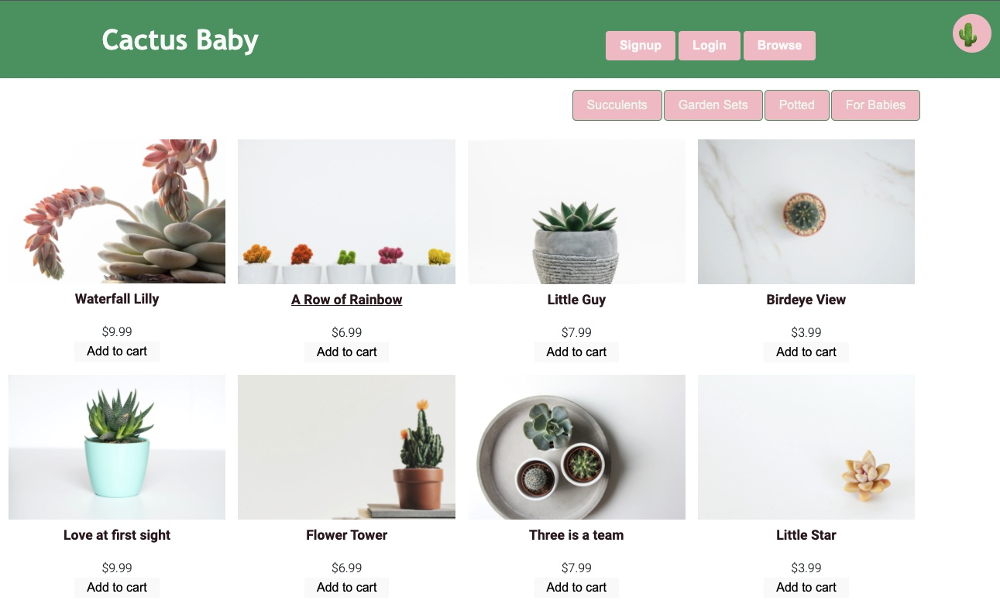

# Cactus-Baby
An E-Commerce website for all things Succulents. BABY CACTUS is a
simple and user-friendly interface with ability to create an account and save your user history, take payment and have off-line access. 

## Description

An E-Commerce website selling succulents and cacti to plant lovers all over the world...

## User Stories
* As a user I want to have a pretty and functional plant online store:

* As a user, I want to be able to add products to my shopping cart

* As a user, I want to be able to see my shopping cart from any page

* As a user, I want to be able to update or delete the quantity of shopping cart items

* As a user, I want to be able to persist my current shopping cart items if I close the browser tab

* As a user, I want to be able to view and add products to my shopping cart with or without a network connection

* As a user, I would like to be able to use my credit card to process and complete my order

## Built With
* JS
* CSS
* MongoDB
* Express
* React
* Node
* ServiceWorker
* Herokuapp
* 
* Bootstrap

## Contributing

#### Julian Perez - Back-end Development, Heroku Deployment
#### Cristian Farias - Front-end Styling & Layout, Heroku deployment and
#### Nellia Fleurova-Char - Front-End Database Seeding & Product Layout, Heroku Deployment
#### Waleed Baig - Page Routing & Home/Main Page Layout, Heroku Deployment

## Delpoyed Website
https://intense-peak-73506.herokuapp.com/

## Screenshot

